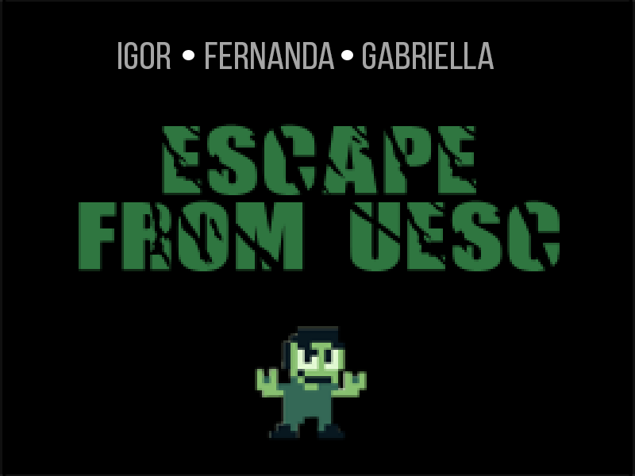
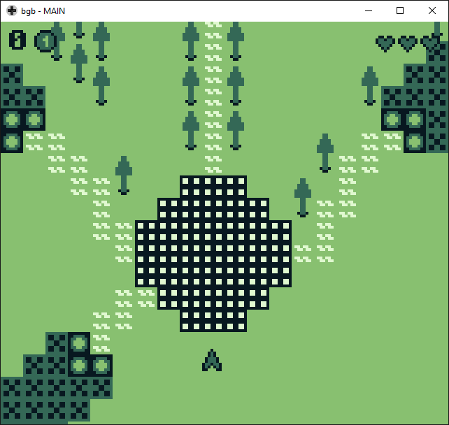
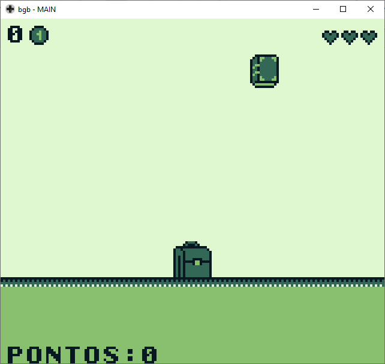
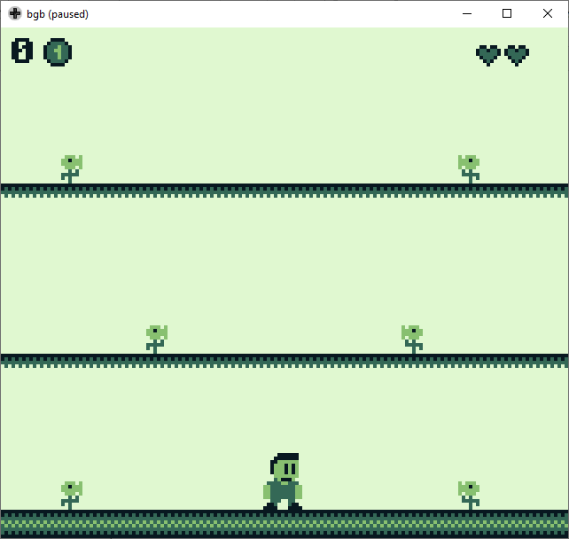
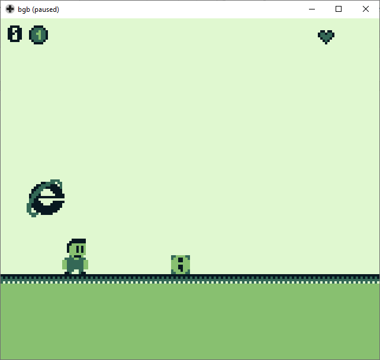
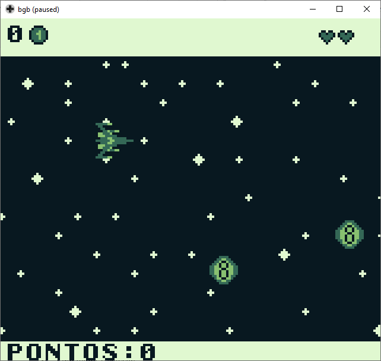
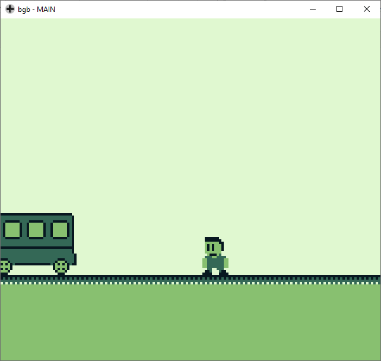

# Escape From UESC

## GUIA DO JOGO

### EQUIPE

* [Igor Lima Rocha](https://github.com/IgorRoc)
* [Fernanda Caroline Leite](https://github.com/FekLeite)
* [Maria Gabriella Araújo Oliveira](mailto:maria0gabriella@gmail.com)

### NOME DO JOGO

**Escape From UESC**

### HISTÓRIA DO JOGO

Quando Igor decidiu entrar na UESC não imaginava o que esperava por ele. Muito mais difícil que entrar era sair daquele lugar. A cada ano os obstáculos aumentavam e não havia melhor lugar para esquecer os problemas do que jogar sinuca no CEU. Até que um dia tudo mudou... Igor passou a ver a UESC com outros olhos e tudo que estava lá se transformou, livros ganharam vida, bolas de sinuca o perseguiam, as plantas estavam em todos os lugares e seu maior medo era a internet. Parecia um sonho, mas era realidade... foi aterrorizante. Então ele tomou a decisão mais importante de sua vida: Escapar daquele lugar. Desse momento em diante sua missão era achar a “chave” dos mistérios da UESC e finalmente realizar seu maior sonho, LIBERDADE.

### ARTE DE CAPA

### O JOGO

#### Mapa Principal

#### Biblioteca

A fase da biblioteca consiste em pegar os livros que estão caindo com uma mochila. Mas cuidado no meio dos livros também tem caveiras que tiram sua vida e deixam o jogo mais lento. A cada livro que for pego a velocidade do jogo aumenta. Quando o jogador pegar 10 livros o jogo acaba e ele ganha uma das letras.

#### Jorge Amado

No pavilhão Jorge Amado a fase consiste em escapar de plantas que chegam de todos os lados pulando sobre elas ou pulando as plataformas. Ao longo da fase vão aparecendo moedas para o jogador pegar e elas são essenciais para acabar o jogo. Após pegar um numero de moedas determinado irá aparecer outra letra, a qual o jogador deve pegar. Cada vez que o jogador encostar em uma planta ele perde uma vida.

#### Exatas

A fase desse pavilhão consiste em fugir do “monstro” Internet Explorer que segue o personagem e pular de obstáculos que são blocos de ponto e vírgula. Se o jogador encostar no “monstro” ou em algum dos blocos ele perde uma vida. Durante a fase vão aparecer moedas pelo caminho e ela só termina quando o jogador pega a xícara de café. Então ele ganha mais uma letra.

#### CEU

Por fim nessa última fase o jogador é uma nave no espaço e deve desviar de bolas de sinuca que tentam atingir a nave. A cada bola que ele encostar perde uma vida. Ganha o jogador que desviar de determinado numero de bolas. A velocidade aumenta ao longo do tempo. O jogador ganhará mais uma letra ao final dessa fase.

#### RU

Local onde o jogador poderá recuperar sua vida, uma de cada vez com a taxa de uma moeda. Há um tempo de espera, que corresponde à fila do RU.

#### Guarita

Quando o jogador conseguir passar as 4 fases e tiver as 4 letras da palavra UESC ele deverá se dirigir a guarita no mapa para sair.

### INSTRUÇÕES

#### Objetivo

O objetivo do jogo é juntar todas as letras da palavra UESC para conseguir escapar. Essas letras são dadas ao jogador em cada fase. No jogo há um total de 4 fases que se encontram em locais específicos da UESC, são eles: Jorge Amado, Biblioteca, CEU e Ciências Exatas. Além de locais extras como a torre, o RU e a guarita.

#### Controles:

Tecla    |  Funcionalidade
:------: | :-----------:
W        | Direção para cima e pulo 
A        | Direção para esquerda
D        | Direção para direita
S        | Direção para baixo
E        | Pulo maior e seleção 
ENTER    | Start

#### Pontuação

A pontuação varia a cada fase.

#### Vidas

O jogador começa com três vidas e ao longo das fases pode perde-las. A qualquer momento ele pode sair de qualquer fase e recuperar suas vidas entrando no RU e pagando uma taxa de uma moeda. O jogador NÃO deve deixar que acabem suas três vidas de uma vez pois assim ele não poderá recupera-las, o jogo acabará e ele terá que começar tudo outra vez.

### GÊNERO DO JOGO

Escape

### DIFICULDADES ENCONTRADAS

A principal dificuldade encontrada foi em relação a biblioteca GBDK. A falta de uma documentação detalhada nos obrigou a aprender muitas coisas por meio de testes. Além disso o fato de ser uma biblioteca instável também impôs dificuldades, diversos erros apareciam no código, erros em arquivos que nem existiam por exemplo.
Uma outra dificuldade foi a limitação de memória por causa disso tivemos que adequar varias vezes nosso código, background e sprites. 

### TÉCNICAS UTILIZADAS

Manipulação de frequência para produzir sons.

### CONTRIBUÇÕES DOS MEMBROS

Todos os membros contribuíram em todas as áreas citadas abaixo, porém cada um ficou mais responsável por alguma parte do projeto.

* **Igor Lima Rocha:** Criação da história e fases, programação, desenho de sprites, apresentação.
* **Fernanda Caroline Leite:** Criação da história e fases, programação, relatório, desenho de sprites, apresentação.
* **Maria Gabriella Araújo Oliveira:** Criação da história e fases, slides, relatório, apresentação.